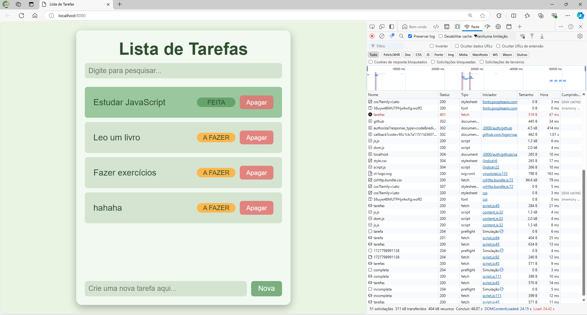
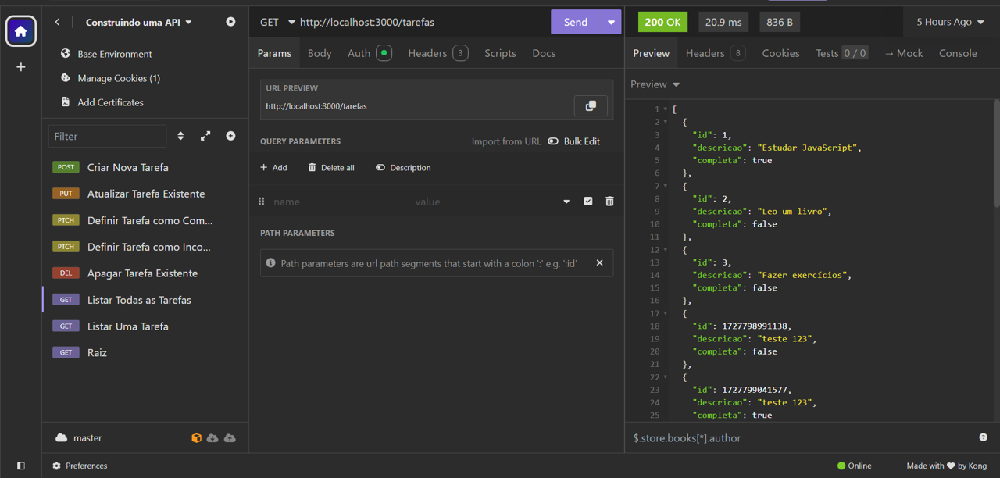

# API de Tarefas

Uma API RESTful leve para gerenciamento de tarefas, construída com Node.js, Express, autenticação via GitHub OAuth e persistência de dados utilizando Prisma como ORM. Esta API atua como o backend para o frontend "Lista de Tarefas Simples", disponível em ([https://github.com/marcelomduarte/javascript_to_do_list_frontend](https://github.com/marcelomduarte/javascript_to_do_list_frontend)), sendo ideal para integração com interfaces personalizadas, aprendizado ou desenvolvimento de aplicações web.

## Demonstração

- **Frontend**: Acesse a versão ao vivo do frontend em [https://todolist-marcelomd-projects.vercel.app](https://todolist-marcelomd-projects.vercel.app).

- **Capturas de tela**:

  - Interface do frontend:

    

  - Teste no Insomnia::

    

## Funcionalidades

- Listar todas as tarefas.
- Obter uma tarefa específica.
- Criar nova tarefa.
- Atualizar tarefa existente.
- Marcar tarefa como completa ou incompleta.
- Deletar tarefa.
- Autenticação via GitHub OAuth.

## Estrutura do projeto

```text
/javascript_to_do_list_frontend
├── /assets
│   ├── frontend.png
│   └── insomnia.png
├── /src    
│   ├── aplicativo.js    
│   ├── configuracao.js
│   ├── env.json           
│   ├── index.js   
│   ├── lista-de-tarefas.json    
│   └── tarefas.js     
├── .gitignore
├── package-lock.json
├── package.json
└── README.md
```

## Instalação e execução

1. **Clone o repositório**:

   ```bash
   git clone https://github.com/marcelomduarte/javascript_to_do_list_backend.git
   ```

2. **Acesse o diretório**:

   ```bash
   cd javascript_to_do_list_backend
   ```

3. **Instale as dependências**:

   ```bash
   npm install
 
4. **Configure o arquivo `.env.json`**:

   ```javascript
   {
     "authRedirect": "/usuario",
     "sessionSecret": "SESSION_SECRET",
     "corsOrigin": "http://localhost:3000,http://localhost:8080",
     "githubClientID": "YOUR_GITHUB_CLIENT_ID",
     "githubClientSecret": "YOUR_GITHUB_CLIENT_SECRET",
     "githubCallbackURL": "http://localhost:3000/auth/github/callback"
   }
   ```

   - **Credenciais do GitHub OAuth**:

     - **Acesse as configurações do GitHub**:

       - Faça login em [github.com](https://github.com)
       - Clique no seu perfil (canto superior direito) → **Settings**

     - **Crie um OAuth App**:

       - No menu lateral: **Developer settings** → **OAuth Apps**
       - Clique em **New OAuth App**

     - **Preencha**:

       - **Application name**: `ToDo List App` (ou nome de sua escolha)
       - **Homepage URL**: `http://localhost:3000`
       - **Authorization callback URL**: `http://localhost:3000/auth/github/callback`

     - **Obtenha as credenciais**:

       - Clique em **Register application**
       - Após criar o app, copie o **Client ID** para `githubClientID`
       - Clique em **Generate a new client secret** e copie para `githubClientSecret`
       - **Importante**: Guarde o Client Secret em local seguro, ele só é exibido uma vez

5. **Inicie a aplicação**:

   ```bash
   npm start
   ```

6. **Acesse a aplicação**:

   - Backend: `http://localhost:3000`
   - Frontend local: `http://localhost:8080`

## Endpoints

| Método  | Endpoint              | Descrição                         |
| ------- | --------------------- | --------------------------------- |
| GET     | `/tarefas`             | Lista todas as tarefas           |
| GET     | `/tarefa/:id`          | Lista uma tarefa específica      |
| POST    | `/tarefa`              | Cria uma nova tarefa             |
| PUT     | `/tarefa/:id`          | Atualiza uma tarefa existente    |
| PATCH   | `/tarefa/:id/completa` | Define tarefa como completa      |
| PATCH   | `/tarefa/:id/incompleta` | Define tarefa como incompleta  |
| DELETE  | `/tarefa/:id`          | Apaga uma tarefa                 |

## Autenticação e integração

- **Autenticação**: A API implementa autenticação via GitHub OAuth com passport (`import passport from 'passport'`), usando `passport-github2` e `express-session`, exigindo autenticação para persistir tarefas, mas permitindo acesso sem autenticação com dados temporários.

- **Integração com frontend**: O frontend "Lista de Tarefas Simples", interage com os endpoints via requisições HTTP, usando cookies de sessão para autenticação OAuth quando configurada, com dados persistidos apenas em modo autenticado.
